# outAndAbout
group project1

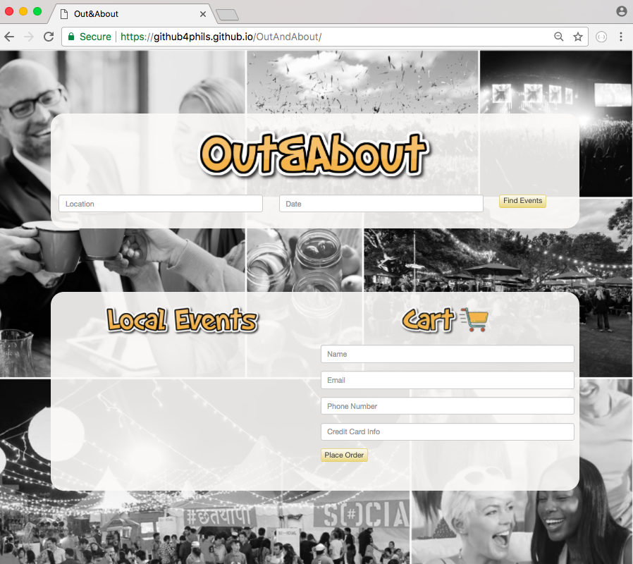

## Why and how it's been created:

Desiree will be going to Iceland and wants to know how to get events around the area as well as where to park when she gets there. Currently, different cities have their own specific websites to show the event going on their town. Google also shows events, but we want to create something that's more an all in one place for the info we need.

This is a project we created as a team. 
API's used:

## geocode
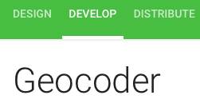
## parkWhiz

## Eventful
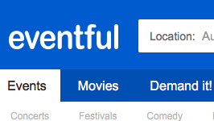

## USER FLOW/INPUT
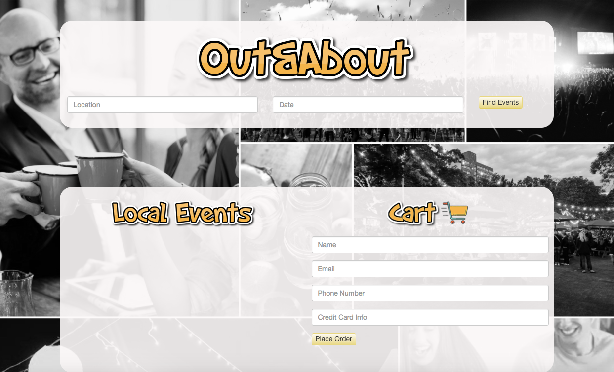

### 1.The app user will input a city and date.

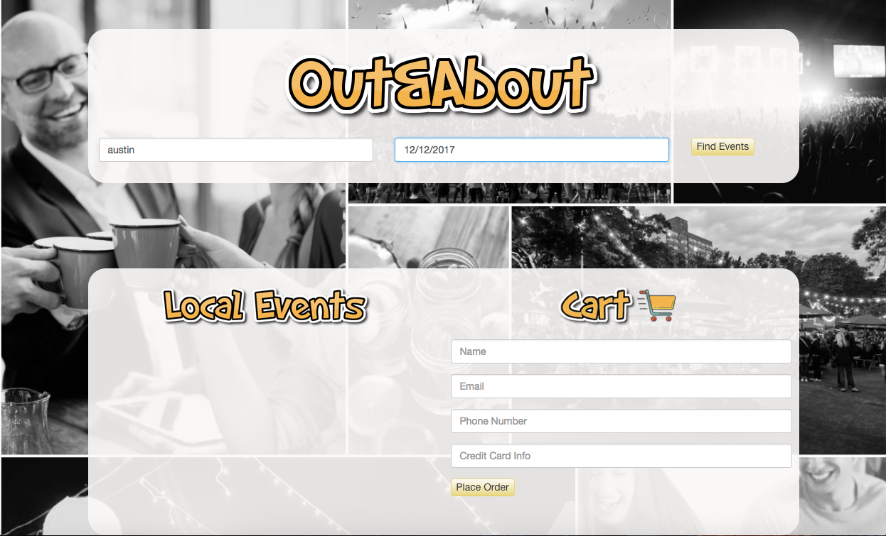

### 2.The app will show a list of events in that specific city and date provided by the user.

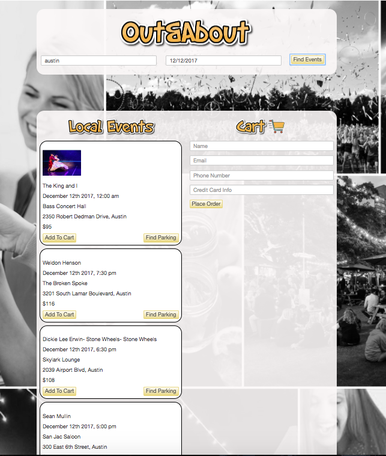
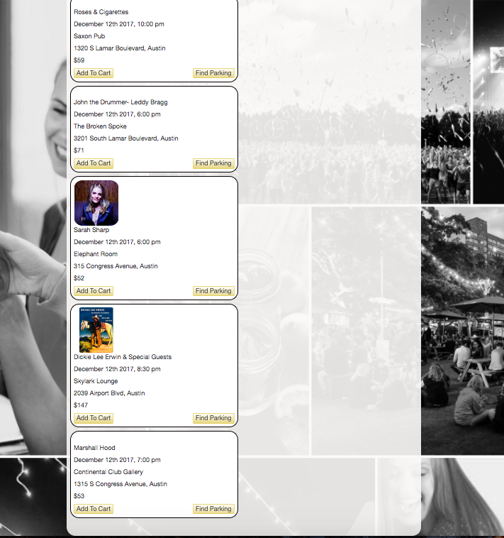

### 3.The user then clicks on the event she picked and liked, and that is added to the CART  on the right hand side where her list of events are stored.

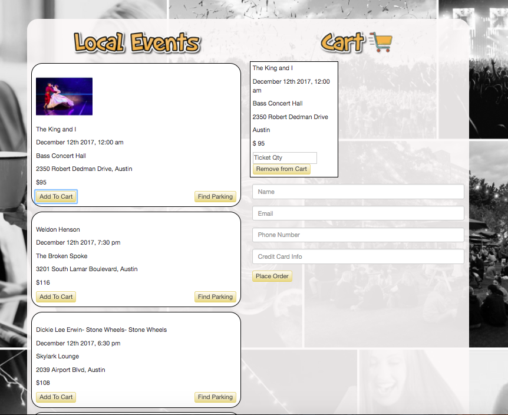
### 4.The user then will also be given a button for parking, when clicked, adds it to the CART as well.

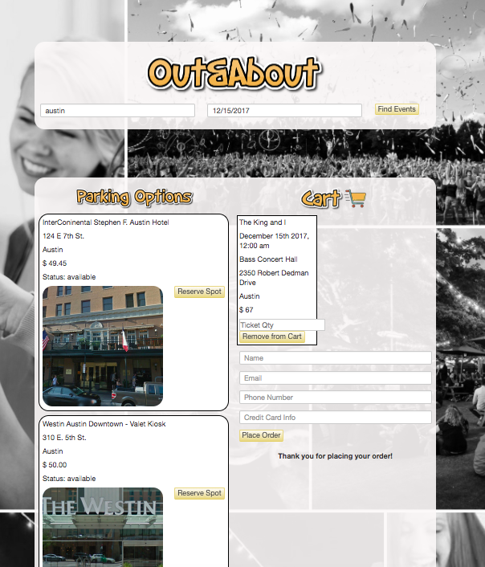
### 5.When the user is done selecting events as well as parking, they will then have to type in ther info to save the event.

### 6. Selected event and parking in Cart

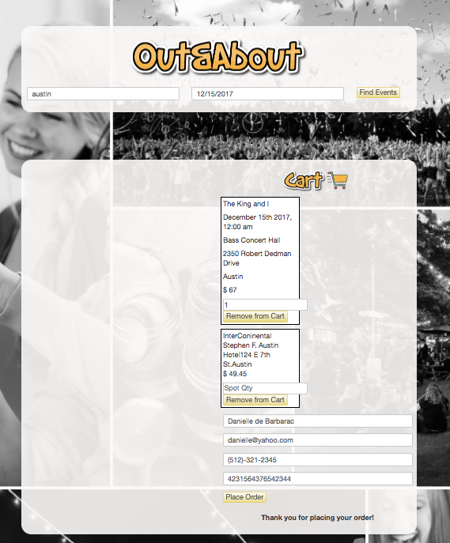

### 7. Finish by printing a receipt to the user in a pdf format

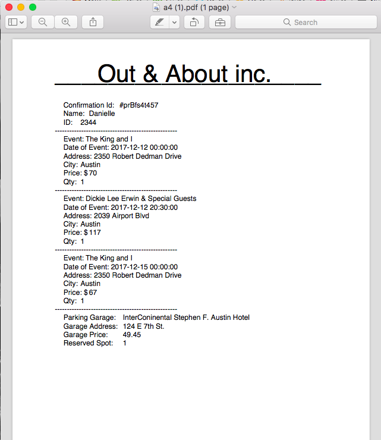

## Back end part

## Firebase

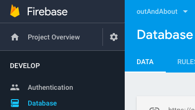

our data structure in firebase

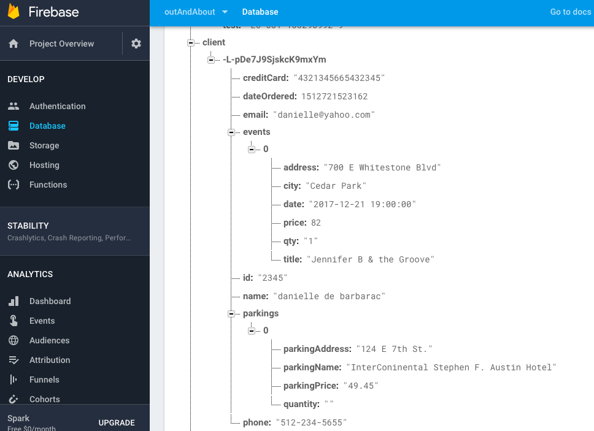

script code for the data dump

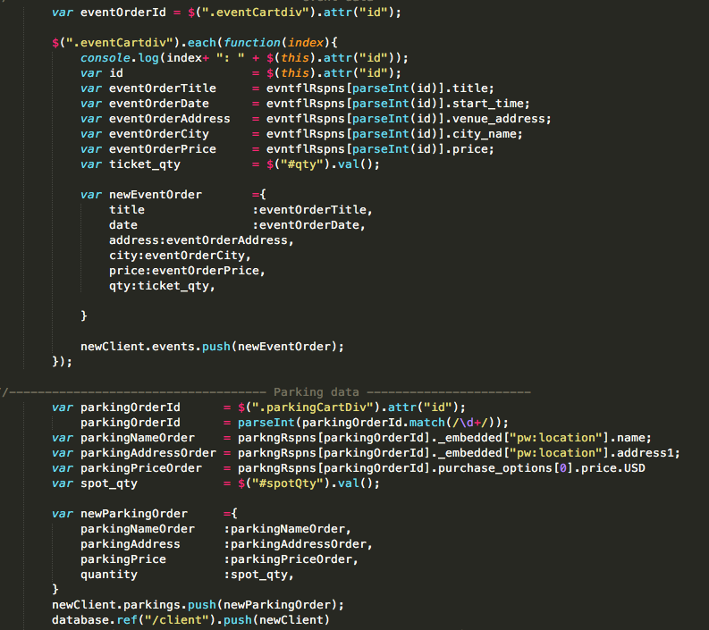

user validation for important information from the cart

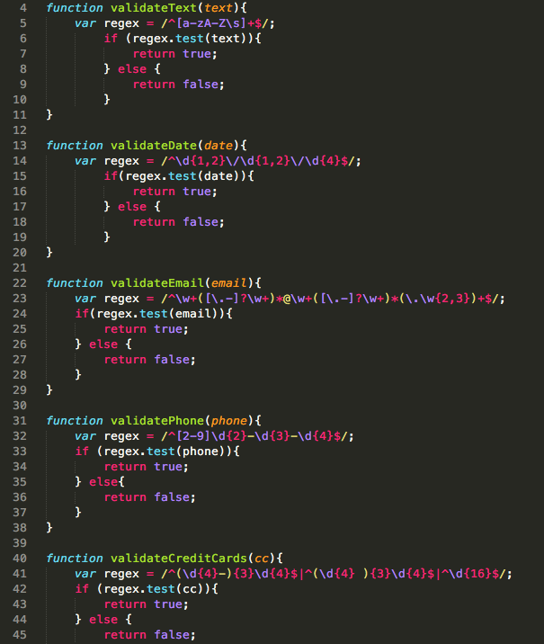
